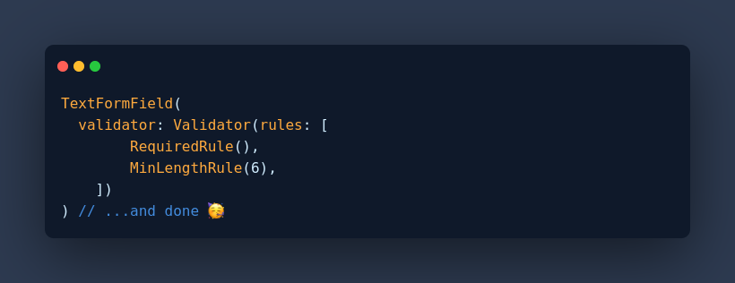

# Flrx Validator


[](https://cirrus-ci.com/github/flrx/validator)
[](https://codecov.io/gh/flrx/validator)
[](https://github.com/flrx/validator/blob/master/LICENSE)

A fluent API based validator designed around flutter that promotes code reuse. It is highly extensible, modular and testable.



## Installation

Add the following to your `pubspec.yaml` file

```yaml
dependencies:
  flrx_validator: ^0.4.0+1
```

## Usage

### Documentation

For more info on Flrx Validator and Rules you can see the [**documentation**](https://flrx.github.io/validator). 

### Built In Rules

|       Rule      |   Arguments  | Description |
|-----------------|--------------|-------------|
|    `AnyRule`    |   ruleList   | Takes A list of rules, Passes when any of the rule passes, Useful for Validation of Username/Email Fields or similar fields|
|    `EachRule`    |   ruleList   | Takes A list of rules, Passes when all of the rule passes and returns validation message for all rules, Useful for Validation of Password Fields or similar fields|
|   `EmailRule`   |      -       | Passes when String is an E-Mail |
|     `InRule`    | acceptedList | Passes when the value is included in the given list of values. |
| `MaxLengthRule` |   maxLength  | Passes when the String length is less than the given length |
| `MinLengthRule` |   minLength  | Passes when the String length is more than the given length |
|   `NotInRule`   | rejectedList | Passes when the value is not included in the given list of values. |
|   `RegexRule`   |    regex     | Passes when the value matches the given Regex. |
|  `RequiredRule` |       -      | Passes when the value is not null or empty. |

Can't see a rule you need? Raise an issue or create a Pull Request.

### Example

```dart
import 'package:flrx_validator/flrx_validator';
import 'package:flrx_validator/rules/email_rule.dart';
import 'package:flrx_validator/rules/required_rule.dart';

....
....

TextFormField(
    validator: Validator<String>(
      rules: [RequiredRule(), EmailRule()]
    )
);

....
....

```

## Contributing

Please see [**CONTRIBUTING**](https://github.com/flrx/validator/blob/develop/CONTRIBUTING.md).

## License

Please see [**LICENSE**](https://github.com/flrx/validator/blob/develop/LICENSE).
