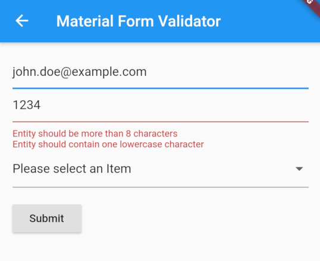

# Rule

[[toc]]

## Introduction

`Rule` encapsulates validation logic and its associated validation message. They are reusable and easily testable.

## Built-in Rules

Flrx Validator comes with lot of built-in rules:

### RequiredRule

This `Rule` validates if the input provided to it is not empty.
It explicitly supports String, Map and Iterable.
It implicitly supports any type which has the length getter.
For any other type, the nullability of the value is tested,

```dart
Validator<String>(rules: [RequiredRule()])
```

**Output**

```
Entity is required
```

### MaxLengthRule

This `Rule` validates if the input's length is less than the max limit.
It explicitly supports String, Map and Iterable.
It implicitly supports any type which has the length getter.

```dart
Validator<String>(rules: [MaxLengthRule(20)])
```

**Output**

```
Entity should be less than 20 characters
```

To use it with your custom types, initialize the rule with dynamic Type.

```dart
Validator<MyCustomType>(rules: [MaxLengthRule<dynamic>(20)])
```

### MinLengthRule

This `Rule` validates if the input's length is more than the min limit.

```dart
Validator<String>(rules: [MinLengthRule(6)])
```

**Output**

```
Entity should be more than 6 characters
```
The supported types and usage are similar to `MaxLengthRule`

### RegexRule

This `Rule` validates if the input matches a `RegEx` pattern.

```dart
Validator<String>(rules: [RegexRule(r"([(+]*[0-9]+[()+. -]*)")])
```

**Output**

```
Value is not a valid pattern
```

### EmailRule

This `Rule` is an extension of `RegexRule` which checks the input against the email regex pattern.

```dart
Validator<String>(rules: [EmailRule()])
```

**Output**

```
Value is not a valid email address
```

### InRule

This `Rule` checks if the value provided is in the list of accepted values.

```dart
Validator<String>(rules: [InRule(['value1', 'value2', 'value3'])])
```

**Output**

```
Entity is not in the list of accepted values.
```

### NotInRule

This `Rule` checks if the value provided is not in the list of rejected values.

```dart
Validator<String>(rules: [NotInRule(['value1', 'value2', 'value3'])])
```

**Output**

```
Entity is in list of rejected values.
```

### AnyRule

This `Rule` checks whether the input provided passes any of the `Rule`s provided to `AnyRule`.

```dart
Validator<String>(rules: [AnyRule([MinLengthRule(6), EmailRule()])])
```

**Output**

```
Value is not a valid email address.
```

### EachRule

This `Rule` checks whether the input provided passes all of the `Rule`s provided to `EachRule`.
This rule also returns the validation message for all `Rule`s passed to it.

```dart
Validator<String>(rules: [
  EachRule([
    MinLengthRule(8),
    RegexRule(
      r'(?=.*[a-z])',
      validationMessage: ":entity should contain one lowercase character",
    ),
  ])
]);
```

**Output**



`EachRule` also accepts a `concatenator` which concatenates all the validation messages.

## Custom Validation Rule

The built-in rules are not an exhaustive list of rules that can be possible. Hence the user can always extend the `Rule` class and create custom validation `Rule`s according to the requirements.

The custom validation rule can be written this way:

<<< @/code/custom_rule.dart

## Custom Validation Message

All rules can take a custom validation message in case you want to show something else instead of the built in message.

You can pass a custom message as follows

```dart
Validator<String>(rules: [
  RequiredRule(validationMessage:"Email is needed for creating an account")
])
```

**Output**

```
Email is needed for creating an account
```

## Transforming the message

All rules can take `transformMessage` function as well just like the `Validator`.

You can refer [**`Validator.transformMessage()`**](./validator.html#transforming-the-message) for more Info.
